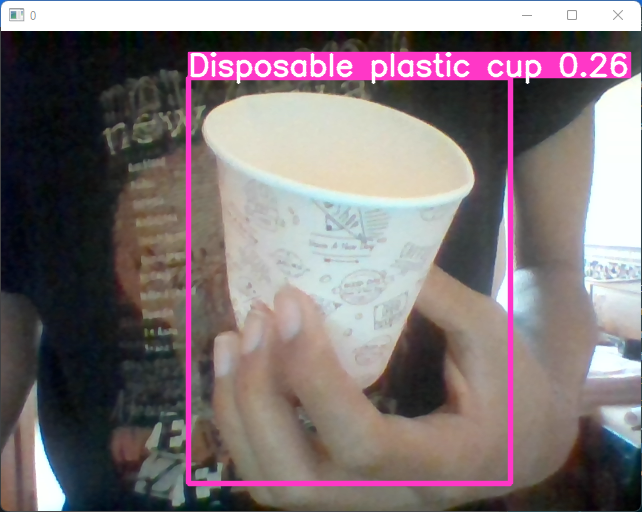
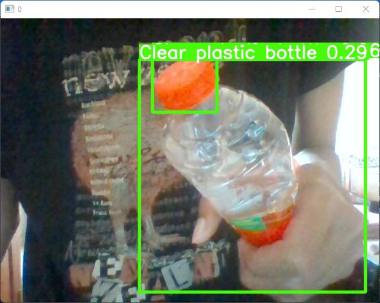

# Deteksi-Sampah
model dibuat untuk project SOBS

Waste_Classification.ipynb for object detection using taco dataset
deteksi_sampah.ipynb for object detection using roboflow

inference using model from Waste_Classification.ipynb





## Usage
for training </br>
``` !python train.py --data [path/to/data] --weights [path/to/weights]```
